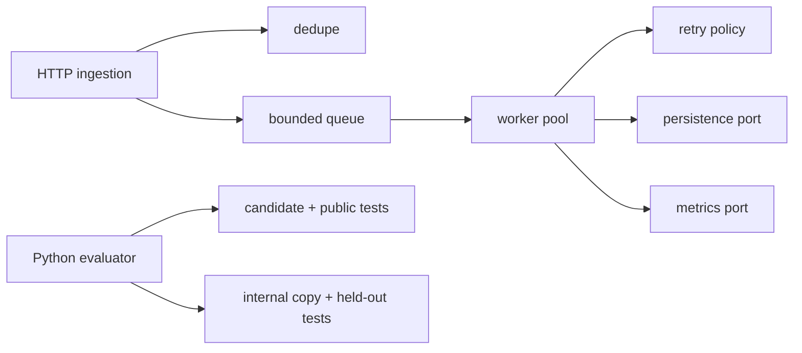

# Go Concurrency Performance RL Lab

[](https://github.com/Kartikm09/go-concurrency-performance-rl-lab/actions/workflows/ci.yml)
[](LICENSE)

A Go 1.26 webhook ingestion and worker system plus four reproducible coding-agent
environments. It demonstrates goroutine lifecycle ownership, context cancellation,
backpressure, deduplication, race-safe metrics, deterministic retry testing, fuzzing,
and benchmark-backed performance work.

**Toolchain:** Go 1.26.5, modules, gofmt, go vet, race detector, native fuzzing and
benchmarks, and pinned golangci-lint 2.12.2.

> Independent proof of work using synthetic payloads and tasks only. No company,
> customer, or private benchmark commissioned or reviewed this repository.

## Architecture



## Task catalogue

| Task | Engineering work | Evidence |
| --- | --- | --- |
| `task-001` | Repair worker leak and shutdown race | race, cancellation, leak, and stress tests |
| `task-002` | Implement bounded backpressure | overload API, metric, and FIFO tests |
| `task-003` | Refactor retry concerns | table-driven golden behavior tests |
| `task-004` | Optimize batch serialization | deterministic lock metric and Go benchmark evidence |

## One-command quick start

```bash
make setup && make verify-all
```

Start the service with `go run ./cmd/api` or `docker compose up --build`; health is
available at `http://localhost:8083/health`.

## Evaluate a patch

```bash
make evaluate TASK=task-001 PATCH=tasks/task-001/golden/solution.patch
```

The evaluator validates patch paths in a candidate-visible baseline, runs public gates,
then overlays held-out tests only in a separate internal workspace. It writes
`result.json`, `evaluation_report.md`, `test_summary.json`, `changed_files.json`,
`timing.json`, and `score_breakdown.json`.

**Accepted example:** the `task-001` golden patch passes `go test -race`, terminates idle
workers, and makes repeated stop safe.

**Rejected example:** a patch changing evaluator-owned files is classified
`prohibited_file_change` before any candidate code runs.

## Quality commands

```bash
test -z "$(gofmt -l .)"
go vet ./...
go test ./...
go test -race ./...
go test -run=^$ -bench=. -benchmem ./...
go test -run=^$ -fuzz=Fuzz -fuzztime=2s ./internal/httpapi
go run github.com/golangci/golangci-lint/v2/cmd/golangci-lint@v2.12.2 run
```

See the measured [benchmark evidence](reports/benchmark-evidence.md) and final
[Docker verification](reports/docker-verification.md).

## Skills demonstrated

Go, HTTP APIs, context cancellation, channels, goroutine lifecycle, bounded queues,
race prevention, backpressure, retries, deterministic clocks, table-driven tests,
httptest, fuzzing, benchmarks, Python evaluator design, Docker, CI/CD, and code review.

## Recruiter walkthrough

1. Scan the architecture and task catalogue.
2. Inspect `internal/queue`, `internal/worker`, and their race/cancellation tests.
3. Compare a task baseline, golden patch, and negative control.
4. Review JSON and Markdown evaluator evidence under `reports/evaluations/`.
5. Read ADRs, CI, security, and release documentation.

## Security and sandbox limitations

Request sizes, queue capacity, and deterministic retry limits are bounded. Evaluator
timeouts, output caps, and path checks are not a hardened code sandbox. Unknown patches
should run only in an externally isolated, credential-free environment.

## Honest limitations

Storage and metrics are in-memory abstractions, payloads are synthetic, and the service
is a compact reliability model rather than a distributed webhook platform. Deterministic
work metrics stabilize scoring; benchmark timings remain machine-dependent.
